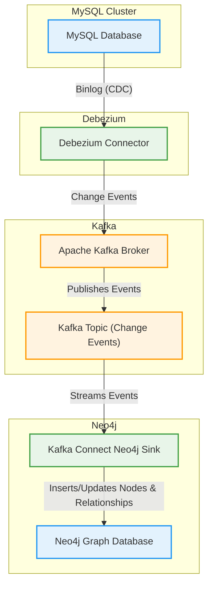

# Neo4j Graph Database Project

[](LICENSE)
[](https://neo4j.com/)
[](https://www.python.org/)
[](#requirements)

> **A robust, production-ready solution for real-time business and financial data management using Neo4j graph technology, Apache Kafka, and Debezium.**

---

## 📚 Table of Contents
- [Neo4j Graph Database Project](#neo4j-graph-database-project)
  - [📚 Table of Contents](#-table-of-contents)
  - [✨ Features](#-features)
  - [🏗️ Architecture Overview](#️-architecture-overview)
  - [🗺️ Architecture Diagram: Real-Time Migration (MySQL → Neo4j via Kafka \& Debezium)](#️-architecture-diagram-real-time-migration-mysql--neo4j-via-kafka--debezium)
  - [📁 Project Structure](#-project-structure)
  - [⚡ Quick Start](#-quick-start)
    - [Requirements](#requirements)
    - [1. Configure Environment](#1-configure-environment)
    - [2. Start Neo4j](#2-start-neo4j)
    - [3. Install Python Dependencies](#3-install-python-dependencies)
    - [4. Export Data from MySQL](#4-export-data-from-mysql)
    - [5. Import Data into Neo4j](#5-import-data-into-neo4j)
  - [📊 Data Model](#-data-model)
    - [Main Node Types](#main-node-types)
    - [Key Relationships](#key-relationships)
  - [🔍 Example Cypher Queries](#-example-cypher-queries)
  - [🛠️ Utilities](#️-utilities)
  - [🔧 Configuration \& Optimization](#-configuration--optimization)
  - [🐛 Troubleshooting](#-troubleshooting)
  - [🤝 Contributing](#-contributing)
  - [📄 License](#-license)
  - [🔗 Resources](#-resources)
  - [📬 Contact](#-contact)
  - [🎥 Demo / Screenshots](#-demo--screenshots)
  - [🤝 Support \& Community](#-support--community)

---

## ✨ Features

- **Real-Time Data Migration**: Stream changes from MySQL to Neo4j using Apache Kafka and Debezium
- **Data Export**: Seamlessly export data from MySQL to Excel and CSV
- **Graph Database Setup**: Effortless Neo4j deployment with Docker
- **Automated Data Import**: Load and relate data using Python scripts
- **Advanced Querying**: Powerful Cypher queries for analytics
- **Extensible Architecture**: Modular scripts for easy customization
- **Performance Optimized**: Indexing, batching, and error handling

---

## 🏗️ Architecture Overview

- **Profiles & Users**: Authentication and user management
- **Companies & Organizations**: Business entity modeling
- **Financial Data**: Invoices, quotes, payments, transactions
- **Products & Services**: Catalog and pricing
- **Geographic Data**: Provinces, cantons, districts, neighborhoods
- **Tax & Legal**: Tax codes, activities, compliance

---

## 🗺️ Architecture Diagram: Real-Time Migration (MySQL → Neo4j via Kafka & Debezium)

Below is a high-level overview of the real-time data migration pipeline:



**Pipeline Explanation:**
- **MySQL Database**: Source of transactional data.
- **Debezium Connector**: Captures change data (CDC) from MySQL binlog in real time.
- **Apache Kafka**: Streams change events through topics.
- **Kafka Connect Neo4j Sink**: Consumes Kafka topics and writes to Neo4j.
- **Neo4j Graph Database**: Receives real-time updates as nodes and relationships.

---

## 📁 Project Structure

```text
Neo4j/
├── data/                  # Data storage
│   ├── nodes/             # Node CSVs
│   ├── relations/         # Relationship CSVs
│   ├── excel/             # Exported Excel files
│   └── csv/               # Raw CSV data
├── neo4j_env/             # Python virtual environment
├── import/                # Neo4j import directory
├── logs/                  # Neo4j logs
├── plugins/               # Neo4j plugins
├── access.py              # MySQL to Excel exporter
├── create_nodes.py        # Node creation script
├── create_relations.py    # Relationship creation script
├── relation.py            # Relationship utilities
├── indexing.py            # Indexing utilities
├── urls.py                # Data source URLs
├── docker-compose.yml     # Docker config
├── .env                   # Environment variables
└── .gitignore             # Git ignore rules
```

---

## ⚡ Quick Start

### Requirements
- [Docker](https://www.docker.com/) & Docker Compose
- Python 3.8+
- MySQL database access
- Neo4j database

### 1. Configure Environment
Create a `.env` file in the project root:
```env
# MySQL
DB_HOST=your_mysql_host
DB_USER=your_mysql_user
DB_PASSWORD=your_mysql_password
DB_NAME=your_database_name
DB_PORT=3306
# Neo4j
NEO4J_URI=bolt://localhost:7687
NEO4J_USERNAME=neo4j
NEO4J_PASSWORD=password
```

### 2. Start Neo4j
```bash
docker-compose up -d
# Neo4j Browser: http://localhost:7474 (default: neo4j/password)
```

### 3. Install Python Dependencies
```bash
python -m venv neo4j_env
source neo4j_env/bin/activate  # On Windows: neo4j_env\Scripts\activate
pip install -r requirements.txt  # Or manually: pip install neo4j python-dotenv mysql-connector-python openpyxl requests pandas numpy
```

### 4. Export Data from MySQL
```bash
python access.py
```

### 5. Import Data into Neo4j
```bash
python create_nodes.py      # Create nodes
python create_relations.py  # Create relationships
```

---

## 📊 Data Model

### Main Node Types
- **Profile**: User profiles
- **Company**: Organizations
- **Product**: Catalog items
- **Factura**: Invoices
- **Quote**: Quotes
- **Message**: Communications
- **Connection**: Network links

### Key Relationships
- `PROFILE__COMPANY_ROLE`: User roles in companies
- `PRODUCT__PROFILE`: Product ownership
- `FACTURAS__LINEA_DETALLES`: Invoice line items
- `MESSAGE__CONVERSATION`: Message threads
- `COMPANY__BARRIO`: Company locations

---

## 🔍 Example Cypher Queries

**Filtering:**
```cypher
MATCH (p:Profile)-[:PROFILE__COMPANY_ROLE]->(cr:Company_role)
WHERE p.email CONTAINS '@company.com'
RETURN p, cr
```

**Data Analysis:**
```cypher
MATCH (c:Company)-[:COMPANY__BARRIO]->(b:Barrio)
MATCH (c)-[:COMPANY__CODIGO_ACTIVIDAD]->(ca:Codigo_actividad)
RETURN c.name, b.name, ca.description
```

---

## 🛠️ Utilities
- `access.py`: MySQL to Excel exporter
- `create_ids.py`: Unique ID generator
- `prepare_relations_for_import.py`: Prepare relationships for import
- `sheet_to_csv.py`: Excel to CSV converter
- `indexing.py`: Create indexes
- `urls.py`: Manage data source URLs

---

## 🔧 Configuration & Optimization
- **Docker**: Includes APOC plugins, volume mounts, port mappings
- **Environment**: All credentials and paths via `.env`
- **Performance**: Indexing, batching, connection pooling, error handling

---

## 🐛 Troubleshooting
- **Connection Errors**: Ensure Neo4j is running and credentials are correct
- **Import Failures**: Check CSV format and data consistency
- **Memory Issues**: Adjust Neo4j memory settings
- **Permission Errors**: Check file permissions
- **Logs**: See `logs/` directory for details

---

## 🤝 Contributing
1. Fork the repository
2. Create a feature branch
3. Make your changes
4. Test thoroughly
5. Submit a pull request

---

## 📄 License
This project is licensed under the MIT License. See [LICENSE](LICENSE) for details.

---

## 🔗 Resources
- [Neo4j Documentation](https://neo4j.com/docs/)
- [Cypher Query Language](https://neo4j.com/docs/cypher-manual/current/)
- [APOC Procedures](https://neo4j.com/docs/apoc/current/)

---

## 📬 Contact
For questions, issues, or support, please [open an issue](https://github.com/sefineh-ai/Neo4j/issues) on GitHub. 

---

## 🎥 Demo / Screenshots
<!-- Add animated GIFs, screenshots, or links to demo videos here to showcase the project in action. -->

---

## 🤝 Support & Community
- For questions, issues, or feature requests, please [open an issue](https://github.com/sefineh-ai/Neo4j/issues).
- Contributions, suggestions, and feedback are welcome! 